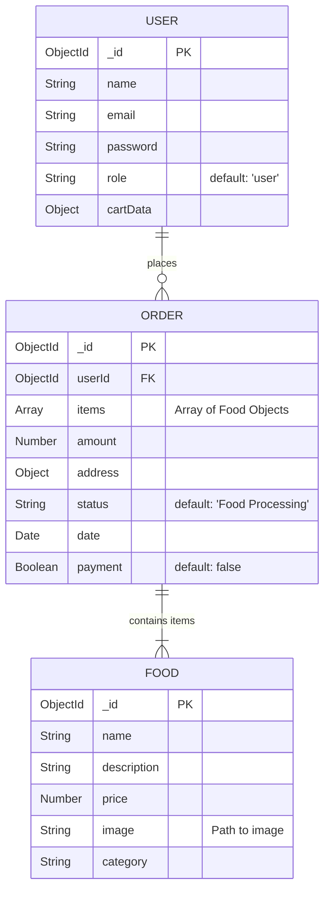

# ER Diagram

This document illustrates the Entity-Relationship structure representing the core data models stored in MongoDB for the application.

```mermaid
erDiagram
    USER ||--o{ ORDER : "places"
    USER {
        ObjectId _id PK
        String name
        String email
        String password
        String role "default: 'user'"
        Object cartData
    }

    ORDER ||--|{ FOOD : "contains items"
    ORDER {
        ObjectId _id PK
        ObjectId userId FK
        Array items "Array of Food Objects"
        Number amount
        Object address
        String status "default: 'Food Processing'"
        Date date
        Boolean payment "default: false"
    }

    FOOD {
        ObjectId _id PK
        String name
        String description
        Number price
        String image "Path to image"
        String category
    }
```