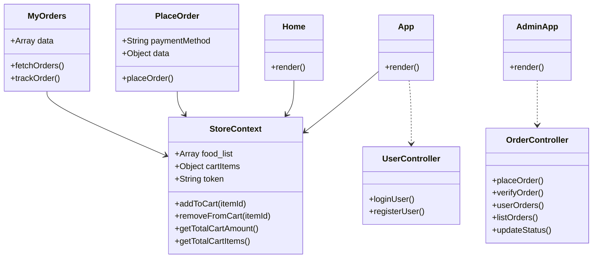

# Class Diagram

The following diagram represents the core structural relationship between React components, Context providers, and Backend Controllers.

```mermaid
classDiagram
    class StoreContext {
        +Array food_list
        +Object cartItems
        +String token
        +addToCart(itemId)
        +removeFromCart(itemId)
        +getTotalCartAmount()
        +getTotalCartItems()
    }
    class App {
        +render()
    }
    class Home {
        +render()
    }
    class PlaceOrder {
        +String paymentMethod
        +Object data
        +placeOrder()
    }
    class MyOrders {
        +Array data
        +fetchOrders()
        +trackOrder()
    }
    class AdminApp {
        +render()
    }
    class UserController {
        +loginUser()
        +registerUser()
    }
    class OrderController {
        +placeOrder()
        +verifyOrder()
        +userOrders()
        +listOrders()
        +updateStatus()
    }
    
    App --> StoreContext
    Home --> StoreContext
    PlaceOrder --> StoreContext
    MyOrders --> StoreContext
    AdminApp ..> OrderController
    App ..> UserController
```