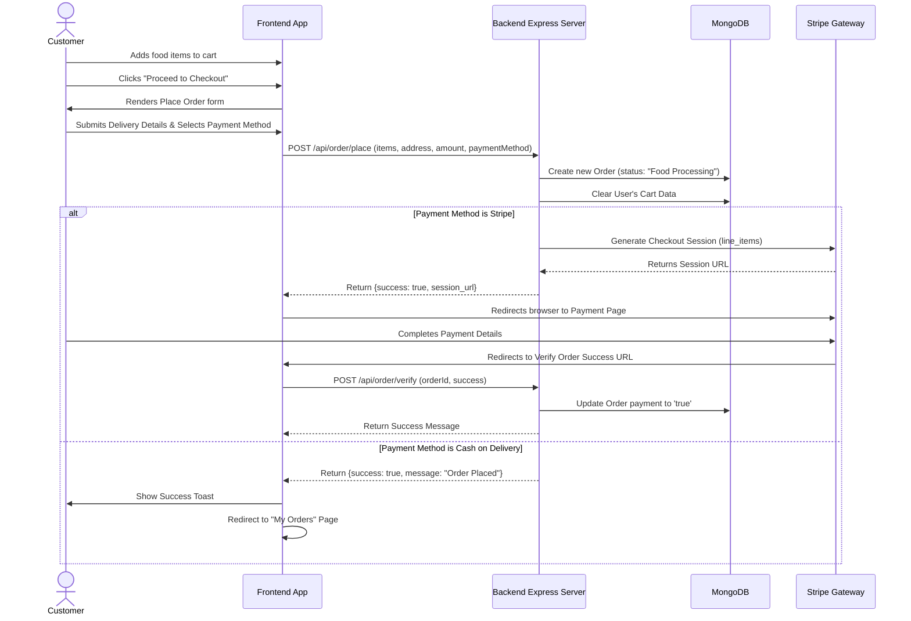

# Sequence Diagram

The following diagram maps out the core user flow from placing an order to finalizing a checkout session in the application.

```mermaid
sequenceDiagram
    actor Customer
    participant UI as Frontend App
    participant API as Backend Express Server
    participant DB as MongoDB
    participant Stripe as Stripe Gateway

    Customer->>UI: Adds food items to cart
    Customer->>UI: Clicks "Proceed to Checkout"
    UI->>Customer: Renders Place Order form
    Customer->>UI: Submits Delivery Details & Selects Payment Method
    UI->>API: POST /api/order/place (items, address, amount, paymentMethod)
    API->>DB: Create new Order (status: "Food Processing")
    API->>DB: Clear User's Cart Data
    
    alt Payment Method is Stripe
        API->>Stripe: Generate Checkout Session (line_items)
        Stripe-->>API: Returns Session URL
        API-->>UI: Return {success: true, session_url}
        UI->>Stripe: Redirects browser to Payment Page
        Customer->>Stripe: Completes Payment Details
        Stripe->>UI: Redirects to Verify Order Success URL
        UI->>API: POST /api/order/verify (orderId, success)
        API->>DB: Update Order payment to 'true'
        API-->>UI: Return Success Message
    else Payment Method is Cash on Delivery
        API-->>UI: Return {success: true, message: "Order Placed"}
        UI->>Customer: Show Success Toast
        UI->>UI: Redirect to "My Orders" Page
    end
```