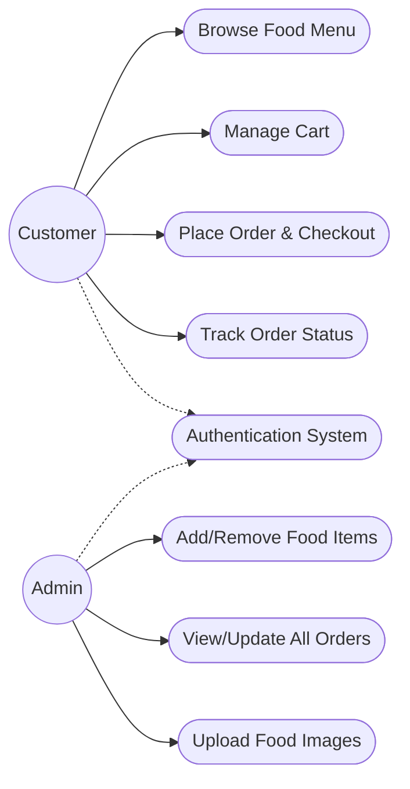

# Use Case Diagram

This diagram displays the primary actions (`use cases`) accessible to the **Customer** and the **Admin**.

```mermaid
flowchart LR
    %% Actors
    Customer((Customer))
    Admin((Admin))

    %% User Specific Use Cases
    BrowseFood([Browse Food Menu])
    ManageCart([Manage Cart])
    PlaceOrder([Place Order & Checkout])
    TrackOrder([Track Order Status])

    %% Admin Specific Use Cases
    ManageFood([Add/Remove Food Items])
    ManageOrders([View/Update All Orders])
    UploadImages([Upload Food Images])

    %% Shared or Related Flow
    LoginSystem([Authentication System])

    %% Connections
    Customer --> BrowseFood
    Customer --> ManageCart
    Customer --> PlaceOrder
    Customer --> TrackOrder
    Customer -.-> LoginSystem

    Admin --> ManageFood
    Admin --> ManageOrders
    Admin --> UploadImages
    Admin -.-> LoginSystem
```